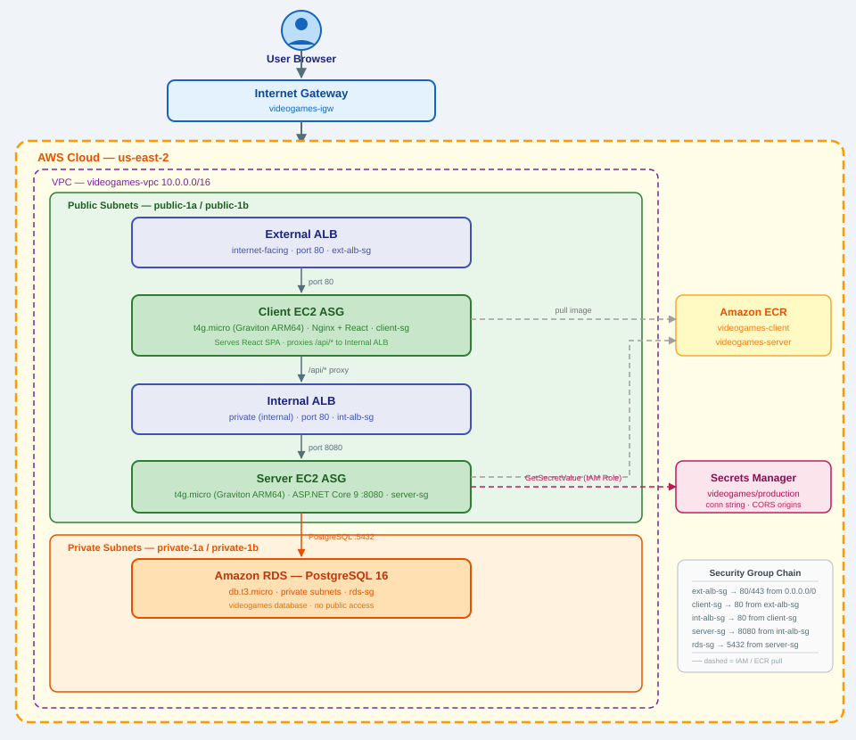
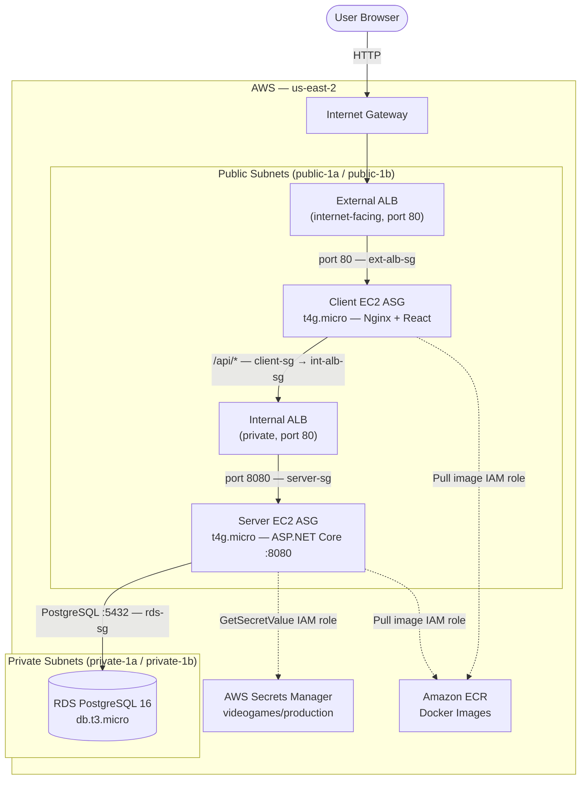

# Video Games Catalogue

A full-stack web application for managing a video games catalogue with browsing and CRUD capabilities.

## Architecture





### Security Group Chain

```
Internet → ext-alb-sg (80, 443)
         → client-sg   (80 from ext-alb-sg)
         → int-alb-sg  (80 from client-sg)
         → server-sg   (8080 from int-alb-sg)
         → rds-sg      (5432 from server-sg)
```

### Request Flow

| Step | From | To | Details |
|---|---|---|---|
| 1 | Browser | External ALB | HTTP :80 |
| 2 | External ALB | Client EC2 (Nginx) | Serves React SPA |
| 3 | Browser | External ALB `/api/*` | API call (same origin) |
| 4 | Client EC2 (Nginx) | Internal ALB | Proxied to :80 |
| 5 | Internal ALB | Server EC2 | ASP.NET Core :8080 |
| 6 | Server EC2 | RDS PostgreSQL | :5432 private subnet |

---

## Tech Stack

### Backend
- **ASP.NET Core 9.0** — Web API
- **Entity Framework Core 9.0** — ORM, Code First
- **PostgreSQL 16** — Database (Amazon RDS)
- **Npgsql** — PostgreSQL EF Core provider
- **AWS Secrets Manager** — Connection strings and sensitive config
- **NUnit + Moq + AutoFixture** — Unit testing

### Frontend
- **React 19** — UI framework
- **TypeScript** — Type safety
- **Vite** — Build tool
- **React Router 7** — Client-side routing
- **React Bootstrap** — UI components
- **Axios** — HTTP client

### Infrastructure
- **Docker & Docker Compose** — Local containerisation
- **Amazon EC2 Auto Scaling Groups** — Compute (t4g.micro, ARM64/Graviton)
- **Application Load Balancer** — External (public) + Internal (private)
- **Amazon RDS PostgreSQL** — Managed database
- **Amazon ECR** — Docker image registry
- **AWS Secrets Manager** — Runtime secrets
- **Amazon VPC** — Network isolation

---

## Local Development

### Prerequisites

- [Docker Desktop](https://www.docker.com/products/docker-desktop)
- [.NET 9 SDK](https://dotnet.microsoft.com/download) (for IDE development)
- [Node.js 20+](https://nodejs.org/) (for IDE development)

### Start with Docker Compose

Runs the full stack locally — React dev server, ASP.NET Core API, and PostgreSQL:

```bash
git clone https://github.com/dranhovskyi/video-games-catalogue.git
cd video-games-catalogue

docker compose up --build
```

| Service | URL |
|---|---|
| Frontend | https://localhost:55028 |
| Backend Swagger | https://localhost:55027/swagger/index.html |

```bash
# Stop
docker compose down
```

### IDE Development (Visual Studio)

The PostgreSQL container must be running before starting the project in Visual Studio:

```bash
docker compose up postgres
```

Then in Visual Studio:
- Set `VideoGamesCatalogue.Server` as the startup project
- Run the `https` profile — this starts both backend and frontend

| Service | URL |
|---|---|
| Frontend | http://localhost:5173 |
| Backend Swagger | https://localhost:7294/swagger/index.html |

### Frontend Debug Mode

With the backend already running:

```bash
cd videogamescatalogue.client
npm install
npm run dev
```

Frontend opens at `http://localhost:5173`.

### Running Unit Tests

Right-click `VideoGamesCatalogue.Server.UnitTests` → **Run Tests**

---

## Database

### Local (Docker Compose)

| Setting | Value |
|---|---|
| Host | `localhost` |
| Port | `5432` |
| Database | `videogames` |
| Username | `postgres` |
| Password | `SecurePass123` |

The schema and seed data are created automatically on first startup via `EnsureCreated()`.

### Production (Amazon RDS)

Connection string and credentials are stored in **AWS Secrets Manager** under `videogames/production`. The server reads them at startup using the EC2 instance's IAM role — no credentials are stored in the codebase or Docker images.

Secret structure:

```json
{
  "ConnectionStrings__DefaultConnection": "Host=<rds-endpoint>;Port=5432;Database=videogames;Username=postgres;Password=<password>;SSL Mode=Require;Trust Server Certificate=true",
  "AllowedOrigins__0": "http://<external-alb-dns>.elb.amazonaws.com"
}
```

---

## Production Deployment

### Build and Push Docker Images

EC2 instances are Graviton (`t4g.micro`, ARM64). Build on Apple Silicon Mac — images are ARM64 natively:

```bash
# Authenticate to ECR
aws ecr get-login-password --region us-east-2 | \
  docker login --username AWS --password-stdin <account-id>.dkr.ecr.us-east-2.amazonaws.com

# Server
docker build \
  -f VideoGamesCatalogue.Server/Dockerfile.prod \
  -t <account-id>.dkr.ecr.us-east-2.amazonaws.com/videogames-server:latest \
  .
docker push <account-id>.dkr.ecr.us-east-2.amazonaws.com/videogames-server:latest

# Client
docker build \
  -f videogamescatalogue.client/Dockerfile.prod \
  -t <account-id>.dkr.ecr.us-east-2.amazonaws.com/videogames-client:latest \
  videogamescatalogue.client/
docker push <account-id>.dkr.ecr.us-east-2.amazonaws.com/videogames-client:latest
```

### Deploy New Version

After pushing updated images, trigger an instance refresh on each Auto Scaling Group:

**EC2 → Auto Scaling Groups → select ASG → Instance Refresh → Start**

The ASG terminates old instances and launches new ones that pull the latest image.
